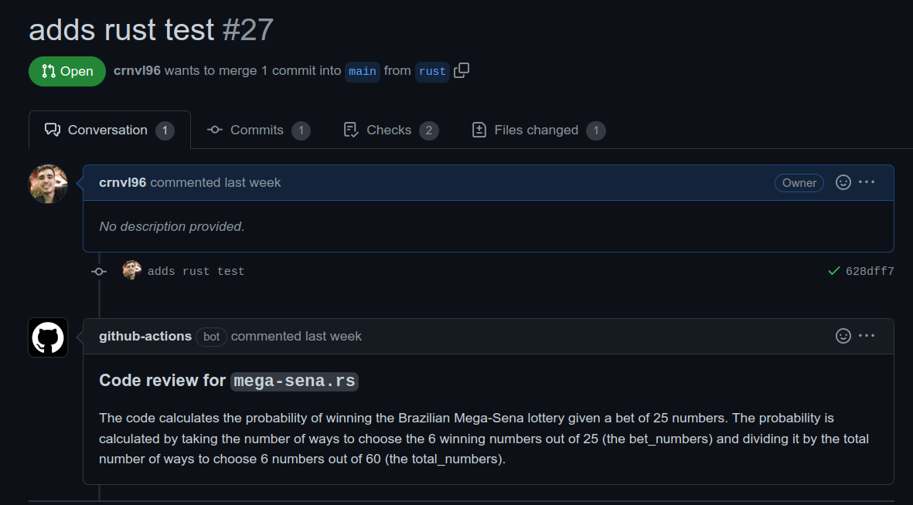
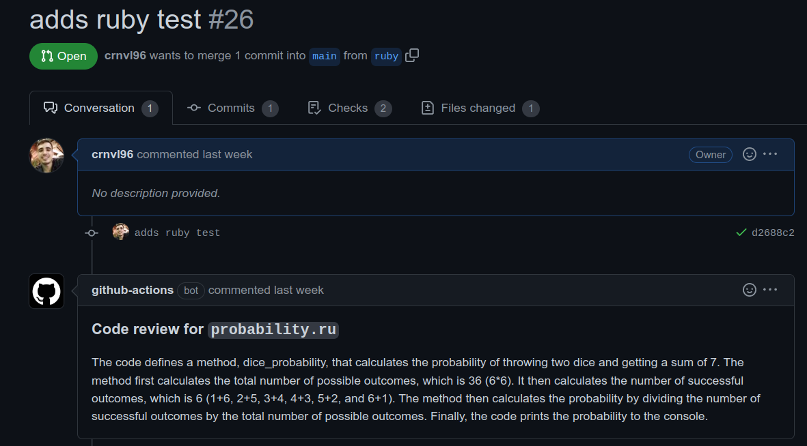

# Ebytr Todo-List

Github action developed using ChatGPT and Golang, that can be used to generate an automated code review from the AI.

This github action is not intended to work in an large amount of files, it was made for study and learning purposes. Any feedbacks are welcome!

## Table of contents

- [General view](#general-view)
  - [The Challenge](#the-challenge)
  - [Images](#images)
  - [Links](#links)
- [The development process](#the-development-process)
  - [Tools used](#tools-used)
  - [Lessons learned](#lessons-learned)
- [Usage](#usage)
- [Testing](#testing)
- [TroubleShooting](#troubleshooting)
- [Author](#author)

## General view

### The challenge

OpenAI CI Golang is a project that generates automated code review using a Github action integration

**The users must be capable of**

- Use this github action in their projects to receive an AI generates explanation about their code.

## Images

<div align="center">
  
  
</div>

## The development process

### Tools used

- Github Actions
- ChatGPT api
- Golang

### Lessons learned

- Using and learning about chatGPT and its applicabilities.
- Using new Golang packages to make the integrations with github and chatGPT easier.
- Improving the knowledge and practical skills with Go language.

## Usage

- You must have an openai api key, which you can get from [this site](https://platform.openai.com/account/api-keys).
- After that, in your repository, go to settings > Secrets and variables > actions > New repository secret.
- Create a secret named "OPENAI_API_KEY", and paste the token you acquired in the previous step there.
- Go to settings > Actions > General
- In the section 'Workflow permissions', click in the option 'Read and write permissions'
- In the root directiory of your repository, create a folder named `.github`
- Inside that folder, create another one named `workflows`
- Create an archive named `openai-code-review.yml`, and add the following content:

```yml
name: OpenAI code review

on:
  push:
    branches: ["*"]
    types: [opened, synchronize, reopened]
  pull_request:
    branches: [ "*" ]
    types: [opened, synchronize, reopened]

permissions: write-all

env:
  API_KEY: ${{ secrets.openai_api_key }}
  GITHUB_TOKEN: ${{ secrets.GITHUB_TOKEN }}
  PULL_REQUEST_NUMBER: ${{ github.event.number }}
  PULL_REQUEST_INFO: ${{ github.repository }}


jobs:
  openai-code-review:
    runs-on: ubuntu-latest
    name: OpenAI code review
    steps:
      - name: Golang setup
        uses: actions/setup-go@v3
        with:
          go-version: 1.19.5

      - name: Checkout
        uses: actions/checkout@v3

      - name: OpenAI code review
        uses: crnvl96/openai-ci-golang@v1.0.4
```

## Author

- LinkedIn - [Ádran Carnavale](https://www.linkedin.com/in/adrancarnavale/)
